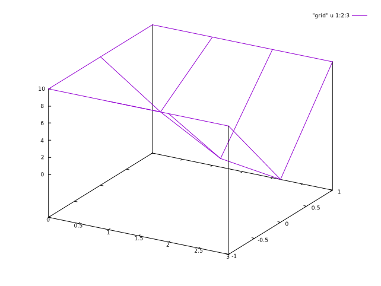
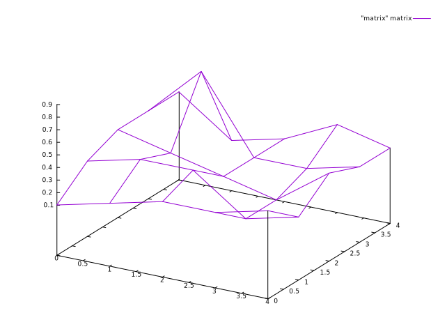

# 3D Data
Gnuplot support two file formats for 3D data to work with `splot`. This article is adapted from *Gnuplot in Action*.

> Usually, 3D plotting does not make much sense since it cannot really provide insights about quantities, and we would like to create its 2D projection (such as *heatmap*).
## Grid format
If the data file is in *grid format*, each line must contain both x and y coordinates, as well as the z value that is to be plotted. Data must be organized into data blocks, which are separated from each other by a single blank line. Each block must contain all data points for *a single row of data points*.

```
<x0> <y0> <z(0, 0)>
<x0> <y1> <z(0, 1)>
<x0> <y2> <z(0, 2)>
...
<x0> <yN> <z(0, N)>

<x1> <y0> <z(1, 0)>
<x1> <y1> <z(1, 1)>
...
```

```
splot "grid" u 1:2:3 w lines
```



## Matrix format
The *matrix format*[^matrix] is an alternative file format for data on a regular, rectangular grid. It’s more compact, because it doesn’t store the (redundant) information on x and y coordinates for every data point—only the z values at the grid locations are kept.

```
splot "matrix" matrix with lines
```



Here we need to specify its format as *matrix* explicitly.

[^matrix] There are two permissible matrix formats, and we only focus on a compact one.