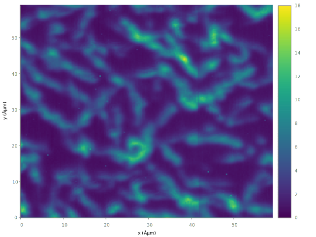

# Palettes
Gnuplot provides a facility to map numeric values into a continuous range of colors. The gnuplot command to create and manage such color gradients is `set palette`. This article is adapted from *Gnuplot in Action*.

## An example

```
set isosamples 200
set palette defined (0 "blue", 0.5 "light-grey", 1 "red")
splot [-2:2][-2:2] exp(-(x**2 +  y**2))*cos(x/4)*sin(y)*cos(2*(x**2+y**2)) w pm3d
```


- The `isosamples` are the number of "samples" in each direction (x and y).
- The `set palette` command is used to create a smooth color gradient palette in gnuplot.
- The `pm3d` (short for palette-mapped 3d) is style for drawing palette-mapped 3d and 4d data as color/gray maps and surfaces.

## Creating palettes
There are basically two different ways to define a color gradient using `set palette`:

- Through a discrete set of colors at fixed positions within the numerical range. The `st palette` command fills in the gaps between these nodes though linear interpolation.
- Through a set of three functions (one for each color component) that map the numerical range to a color component.

In this article, we only discuss the first method.

### Color models and components
The `set palette` command can handle five different color models: RGB (reg-green-blue), HSV (hue-saturation-value), CMY, YIQ, and CIE XYZ. For computer graphics, RGB and HSV are by far the most important, and the default is the RBG model in gnuplot.

To specify the three components, the `set palette` command accepts three different formats:

- A named color, such as `"red"`. Use `show colornames` for a list of permissible colors.
- A hex string, such as `"#ff0000"` or `"0xff0000"`.
- A numeric triple, such as `1 0 0`.

### Defining palette through nodes
You can define a palette by specifying a set of colors at fixed locations within the plot range, and gnuplot will fill in the gaps in between. This is, in my opinion, the most useful way to create palettes in practice.

As what we did in the example, we use the `defined` keyword to specify the list of colors and positions. You can use any of the color format discussed in the previous section, and hence the following four commands are equivalent:

```
set palette defined ( -1 "red", 0 "white", 1 "blue" )
set palette defined ( -1 "#ff0000", 0 "#ffffff", 1 "#0000ff" )
set palette defined(-1 100, 0 111, 1 001 ) 
set palette defined ( -1 "red", 0 "#ffffff", 1 0 0 1 )
```

There’s no limit on the number of entries in the list of colors. The values used as positions aren’t restricted: they can be positive or negative, integer or floating-point. The only constraint is that **they must form a non-decreasing sequence of numbers**. For example, the following is not valid because positions are out of order:

```
set palette defined ( 0 "red", -1 "white", 1 "blue" )
```

It is worth noting that the positions need not correspond to actual values from the plot range! In fact, they aren’t absolute positions at all—they’re merely relative positions in the interval spanned by the smallest and the greatest of the positions. You can also use `set cbrange` to map the palette to the desired plot range.

### Loading palette
I downloaded a palette file (`viridis.pal`) from [Matplotlib colormaps](http://www.gnuplotting.org/tag/palette/), and then *load* it in the script:

```
load 'viridis.pal'
```



The complete script can be found at `color_map.gp`.

> You can use `test palette` to graphically present palette capabilities.
### Sample palettes

Because gnuplot’s default palette isn’t very good, it’s essential that you learn how to define your own palettes. Here are three palettes that are simple enough to keep in mind, so that you can recreate them on the spot.

The first one:

```
set palette defined ( 0 "blue", 0.5 "white", 1 "red" )
```

Despite its extreme simplicity, the blue/white/red palette is amazingly convenient and versatile.

The second one conveys a sense of ordering consists of the traffic light colors (red, yellow, and green): 

```
set palette defined ( 0 "web-green", 0.5 "goldenrod", 1 "red" )
```
In addition to the sense of ordering, this particular trio of colors invariably also conveys a semantic “good/bad” meaning.

The last simple workhorse is the "improved rainbow":

```
set palette defined ( 0 'blue', 1 'cyan', 2 'green', 3 'yellow', 4 'red', 5 'magenta')
```