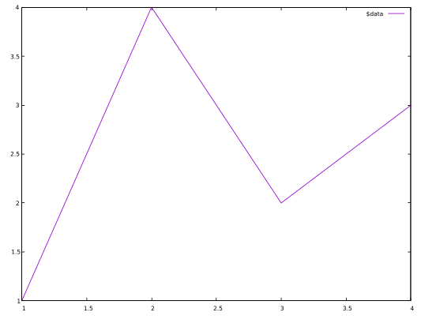
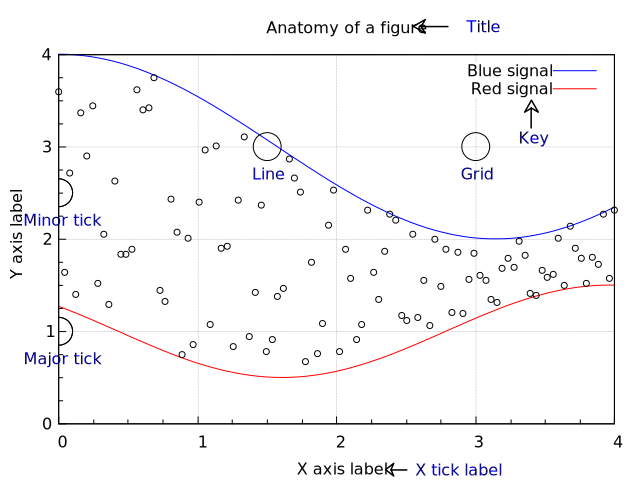
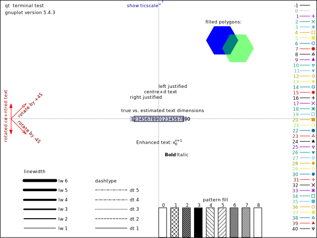

# Basic Usage

This article is adapted from [Basic Usage](https://matplotlib.org/stable/tutorials/introductory/usage.html).

This tutorial covers some basic usage patterns and best practices to help you get started with gnuplot.

Once gnuplot is installed, you can use it in either interactive or batch mode. As for the interactive, it can usually be invoked by issuing the `gnuplot` command at the shell prompt.

Once launched, gnuplot displays a welcome message and then replaces the shell prompt with a `gnuplot>` prompt. Anything entered at this prompt is interpreted as gnuplot commands until you issue an `exit` or `quit` command,

Also, the scripts for plotting can be stored in a plain text file (usually suffixed with `.gp`), and it can be executed by 

```sh
gunplot> load "<file-name>.gp"
```
Note that both single quote and double quote are accepted.

## A simple example
The most important command in gnuplot is `plot`. To draw a line using several points:

```
$data << EOD
1 1
2 4
3 2
4 3
EOD
plot $data with lines
```



As you can see, the default *style* of gnuplot is different from that of matplotlib. For example,

- The line is thinner.
- The font of labels on axes is smaller.
- The legend is displayed.
- ...

Only a few extra commands are required to custom those styles. For example, `unset key` means "*do not display the legend*".

## Parts of a Figure
Here are the components of a gnuplot Figure.



The code for above can be found at `scripts/anatomy.gp`.

## Types of inputs to plotting functions
Plotting command (`plot`) expects a file or a mathematical function as the input. For example, the `plot sin(x)` is able to output a figure of *sin* whose default range of *x* is from -10 to 10. In practice, the input data is usually stored in a file.

> In my opinion, it is more common to *read* external data file for visualization tasks, and gnuplot's way to plotting is more ergonomic in practice, because we can separate data from plotting logics and will not concern about the *reading* step.

To plot the scatter figure as shown [here](https://matplotlib.org/stable/tutorials/introductory/usage.html#types-of-inputs-to-plotting-functions), we can prepare the data containing coordinates, colors and sizes (stored in `data/scatter.dat`):

```
# a(x) c(color) d(size) b(y)
0	49	134.685132	-2.961981
1	20	131.086051	4.801881
2	44	51.744207	-6.497267
3	20	1.665814	-11.207766
```

And the following code (`script/scatter.gp`) can output the similar plot:

```
unset key
set xlabel 'entry a'
set ylabel 'entry b'
set xrange [-5:55]

plot '../data/scatter.dat' using 1:4:($3/30.0):2 \
with points pt 22 ps variable lc variable
```
Note that the size (3rd column) generated is too large for gnuplot, so it is divided by 30.


## Coding styles
As for gnuplot, there is only one style: *command*. To create the simple plot:

```
set title 'Simple Plot'
set xrange [0:2]
set xlabel 'x label'
set ylabel 'y label'
plot x t 'linear', x**2 t 'quadratic', x**3 t 'cubic'
```


Again, the default style of gnuplot may be not what you want. Here are some instructions about how to output an image like the one as shown [here](https://matplotlib.org/stable/tutorials/introductory/usage.html#coding-styles):

- X ticks step 0.5: `set xtics 0,0.25,2`
- Y ticks step 2: `set ytics 0,2,8`
- X ticks label with two digits: `set format x '%.2f'`
- The position of legend: `set key box reverse Left left`
- The size ratio: `set size ratio 2.7/5`

Because gnuplot always plots according to `xrange` if possible, we have to use a small trick to make some blank space. The main idea is to return invalid value for those space:

```
f(x) = (x < 0 || x > 2 ? 1/0 : x)
```

The final code (`script/simple_plot.pg`) would generate a figure like the following:


Wow, a ton of code is required to make the figure look pretty! The good news is that writing the scripts in gnuplot is like building with blocks, and everything here is straightforward; the bad news is that some default styles are a little annoying, and we have to *set* them manually.

From now on, I will not apply the trick to make extra space in the X axis, because in my opinion, this is just an implementation choice.
## Styling Artists
In the plot below we manually set the *linecolor*, *linewidth*, and *linetype* of a line.

> Experienced users of gnuplot like to use the abbreviations. For example, `lc` is short for *linecolor*, `lw` is short for *linewidth*, and `lt` is short of *linetype*. A complete list of the common used abbreviations can be found at [Appendix](../apdx/abbre.md).

The data (`data/artists_data.data`) consists of two columns random numbers.

```
set style line 1 dt 2 lw 4 lc rgbcolor 'blue'
set style line 2 dt 4 lw 2 lc rgbcolor 'orange'
plot '../data/artists_data.dat' using 1 smooth cumulative ls 1, \
'' using 2 smooth cumulative ls 2
```


Let me elaborate on the usage. The fist line `set style line <index> <some properties>`, where *index* can be referred later. So what does the number of each property mean? In gnuplot, each number has its unique meaning, and you can check it by invoke the `test` command:



As we can see, `dt 2` is short for `dashtype 2`, where *2* means *---*; `lw 4` is short for `linewidth 4`; `lc` is short for `linecolor`. In the code above, we use `lc rgbcolor "blue"` to specify a color, and we can also use a magic number, saying, `lc 30`, where *30* also means *blue*. Please check the long list carefully on the right side as illustrated in the figure above.

The first parameter of `plot` is the file name, and `using 1` means selecting the first (*1st*) column. Generally speaking, when it comes to a 2D figure, we need to provide two columns, indicating X and Y respectively, and if only one column is given, then gnuplot considers it as Y, and X is implicit as the index number (starting from 0). To plot multiple lines, we separate them with a column (*,*), and we should not repeat the `plot` command again. We can specify the file name again, but it will be the previous one by default if it is an empty string (*""* or *''*).

One more thing, the option `smooth cumulative` is used to achieve the same effect as `np.cumsum()` does.

### Colors
Gnuplot has a very flexible array of colors that are accepted for most Artists, and users have multiple ways (including a number, an RGB name, and RGB hex value) to specify the colors. Some Artists will take multiple colors. i.e. for a circle plot, the edge of the markers can be different colors from the interior:

```
set style fill solid border lc 'black'
plot '../data/artists_data.dat' using 1:2 with circles fc "greenyellow"
```


The first line is to set the *fill style*, and 0.6 is the degree of transparency. Note that, `fc`, short for *fillcolor* only accepts a *colorspec*, and we cannot pass a plain number to it. You can check all color names by `show colornames` command.