# Basic Usage

This article is adapted from [Basic Usage](https://matplotlib.org/stable/tutorials/introductory/usage.html).

This tutorial covers some basic usage patterns and best practices to help you get started with gnuplot.

Once gnuplot is installed, you can use it in either interactive or batch mode. As for the interactive, it can usually be invoked by issuing the `gnuplot` command at the shell prompt.

Once launched, gnuplot displays a welcome message and then replaces the shell prompt with a `gnuplot>` prompt. Anything entered at this prompt is interpreted as gnuplot commands until you issue an `exit` or `quit` command,

Also, the scripts for plotting can be stored in a plain text file (usually suffixed with `.gp`), and it can be executed by 

```sh
gunplot> load "<file-name>.gp"
```
Note that both single quote and double quote are accepted.

## A simple example
The most important command in gnuplot is `plot`. To draw a line using several points:

```
$data << EOD
1 1
2 4
3 2
4 3
EOD
plot $data with lines
```


As you can see, the default *style* of gnuplot is different from that of Matplotlib. For example,

- The line is thinner.
- The font of labels on axes is smaller.
- The legend is displayed.
- ...

Only a few extra commands are required to custom those styles. For example, `unset key` means "*do not display the legend*".

## Parts of a Figure
Here are the components of a gnuplot Figure.


The code for above can be found at `scripts/anatomy.gp`.

## Types of inputs to plotting functions
Plotting command (`plot`) expects a file or a mathematical function as the input. For example, the `plot sin(x)` is able to output a figure of *sin* whose default range of *x* is from -10 to 10. In practice, the input data is usually stored in a file.

> In my opinion, it is more common to *read* external data file for visualization tasks, and gnuplot's way to plotting is more ergonomic in practice, because we can separate data from plotting logics and will not concern about the *reading* step.

To plot the scatter figure as shown [here](https://matplotlib.org/stable/tutorials/introductory/usage.html#types-of-inputs-to-plotting-functions), we can prepare the data containing coordinates, colors and sizes (stored in `data/scatter.dat`):

```
# a(x) c(color) d(size) b(y)
0	49	134.685132	-2.961981
1	20	131.086051	4.801881
2	44	51.744207	-6.497267
3	20	1.665814	-11.207766
```

And the following code (`script/scatter.gp`) can output the similar plot:

```
unset key
set xlabel 'entry a'
set ylabel 'entry b'
set xrange [-5:55]

plot '../data/scatter.dat' using 1:4:($3/30.0):2 \
with points pt 22 ps variable lc variable
```
Note that the size (3rd column) generated is too large for gnuplot, so it is divided by 30. And we can add a backslash (`\`) to write the command in multiple lines.

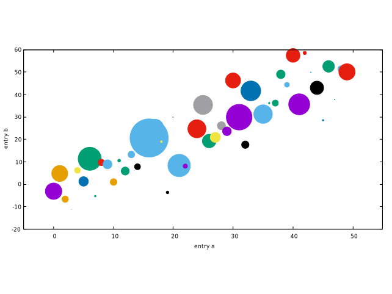

## Coding styles
As for gnuplot, there is only one style: *command*. To create the simple plot:

```
set title 'Simple Plot'
set xrange [0:2]
set xlabel 'x label'
set ylabel 'y label'
plot x t 'linear', x**2 t 'quadratic', x**3 t 'cubic'
```

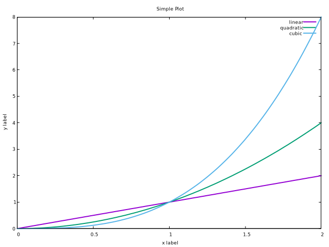

Again, the default style of gnuplot may be not what you want. Here are some instructions about how to output an image like the one as shown [here](https://matplotlib.org/stable/tutorials/introductory/usage.html#coding-styles):

- X ticks step 0.5: `set xtics 0,0.25,2`
- Y ticks step 2: `set ytics 0,2,8`
- X ticks label with two digits: `set format x '%.2f'`
- The position of legend: `set key box reverse Left left`
- The size ratio: `set size ratio 2.7/5`

Because gnuplot always plots according to `xrange` if possible, we have to use a small trick to make some blank space. The main idea is to return invalid value for those space:

```
f(x) = (x < 0 || x > 2 ? 1/0 : x)
```

The final code (`script/simple_plot.pg`) would generate a figure like the following:

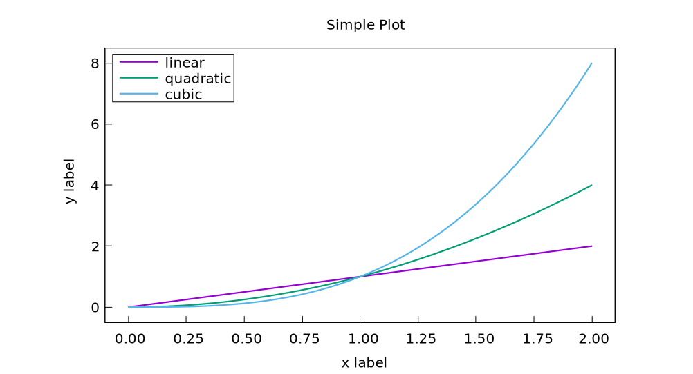

Wow, a ton of code is required to make the figure look pretty! The good news is that writing the scripts in gnuplot is like building with blocks, and everything here is straightforward; the bad news is that some default styles are a little annoying, and we have to *set* them manually.

From now on, I will not apply the trick to make extra space in the X axis, because in my opinion, this is just an implementation choice. By the way, the figures shown in Matplotlib manual are generally scaled to 2.7/5, and we don't set the size ratio manually. If you want to learn how to scale the figure properly, please refer to [Cookbook: Item 1](../cook/1_30.md).

### Functions and styles
Gnuplot is *NOT* a programming language, so you cannot make a *helper* function to lessen your repeated workload. Fortunately, gnuplot has several features which can simplify the script. On the other hand, gnuplot offers mathematical style function definitions. For example, we can define a Gauss function in gnuplot:

```
gauss(x) = exp(-pi*x*x)
```
, where `exp` is the built-in logarithmic function and `pi` is the built-in constant for π.

On the other hand, gnuplot can levitate our labors by *setting styles*. For example, suppose the plots for \\( x \\) and \\( x^2 \\) has the same style, then we can define a common style for them:

```
set style line 1 dt 2 lw 4 lc rgbcolor 'blue'
plot x ls 1,x**2 ls 1
```

The detail of the usage of *styles* can be found at [Styling Artists](#styling-artists).

## Styling Artists
In the plot below we manually set the *linecolor*, *linewidth*, and *linetype* of a line.

> Experienced users of gnuplot like to use the abbreviations. For example, `lc` is short for *linecolor*, `lw` is short for *linewidth*, and `lt` is short of *linetype*. A complete list of the common used abbreviations can be found at [Appendix](../apdx/abbre.md).

The data (`data/artists_data.data`) consists of two columns random numbers.

```
set style line 1 dt 2 lw 4 lc rgbcolor 'blue'
set style line 2 dt 4 lw 2 lc rgbcolor 'orange'
plot '../data/artists_data.dat' using 1 smooth cumulative ls 1, \
'' using 2 smooth cumulative ls 2
```

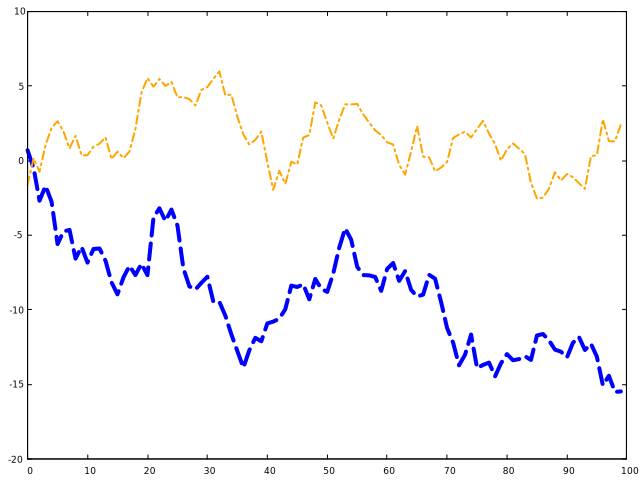

Let me elaborate on the usage. The fist line `set style line <index> <some properties>`, where *index* can be referred later. So what does the number of each property mean? In gnuplot, each number has its unique meaning, and you can check it by invoking the `test` command:


As we can see, `dt 2` is short for `dashtype 2`, where *2* means *---*; `lw 4` is short for `linewidth 4`; `lc` is short for `linecolor`. In the code above, we use `lc rgbcolor "blue"` to specify a color, and we can also use a magic number, saying, `lc 30`, where *30* also means *blue*. Please check the long list carefully on the right side as illustrated in the figure above.

The first parameter of `plot` is the file name, and `using 1` means selecting the first (*1st*) column. Generally speaking, when it comes to a 2D figure, we need to provide two columns, indicating X and Y respectively, and if only one column is given, then gnuplot considers it as Y, and X is implicit as the index number (starting from 0). To plot multiple lines, we separate them with a column (*,*), and we should not repeat the `plot` command again. We can specify the file name again, but it will be the previous one by default if it is an empty string (*""* or *''*).

One more thing, the option `smooth cumulative` is used to achieve the same effect as `np.cumsum()` does.

### Colors
Gnuplot has a very flexible array of colors that are accepted for most Artists, and users have multiple ways (including a number, an RGB name, and RGB hex value) to specify the colors. Some Artists will take multiple colors. i.e. for a circle plot, the edge of the markers can be different colors from the interior:

```
set style fill solid border lc 'black'
plot '../data/artists_data.dat' using 1:2 with circles fc "greenyellow"
```

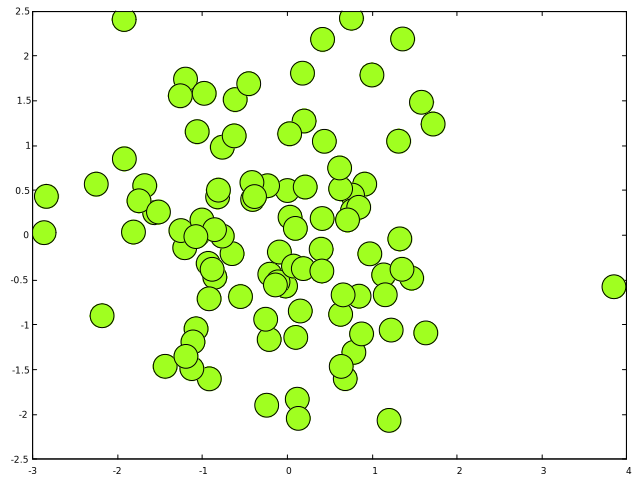

The first line is to set the *fill style*, and 0.6 is the degree of transparency. Note that, `fc`, short for *fillcolor* only accepts a *colorspec*, and we cannot pass a plain number to it. You can check all color names by `show colornames` command.

### Linewidths, linestyles, and pointsizes
The line width and point size are multipliers for the current terminal's default width and size, so you'd better check the styles by invoking the `test` command. By the way, the concept of `MarkerStyle` in Matplotlib is called *pointtype* (the abbreviation form is `pt`) in gnuplot. For example, `pt 5` is a filled square.

```
plot '../data/artists_data.dat' using 1 with points pt 5 ps 2 lc 7 t 'data 1', \
'' using 2 with points pt 11 ps 2 t 'data 2'
```

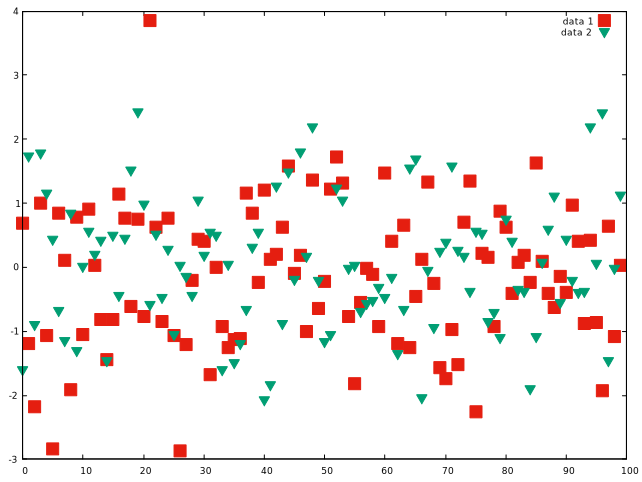

> There is no *pointcolor* in gnuplot! In order to set the color a point, you can use the `lc` (short for *linecolor*).

## Labelling plots

### Axes labels and text
`set xlabel`, `set ylabel`, and `set title` are used to add text in the indicated locations. Text can also be directly added to plots using `set label` command.

First, we prepare a normal distribution dataset (`data/normal.dat`) using the Python code:

```python
mu, sigma = 115, 15
x = mu + sigma * np.random.randn(10000)
```

```
set title "Aardvark lengths\n (not really)"
set xlabel 'Length [cm]'
set ylabel 'Probability'
set label "{/Symbol m} = 115, {/Symbol s} = 15" at 80,600
unset key
set xrange [55:175]
set grid
set style fill solid 0.75
plot '../data/normal.dat' using 1 bins=50 with boxes fc '#4070a0'
```

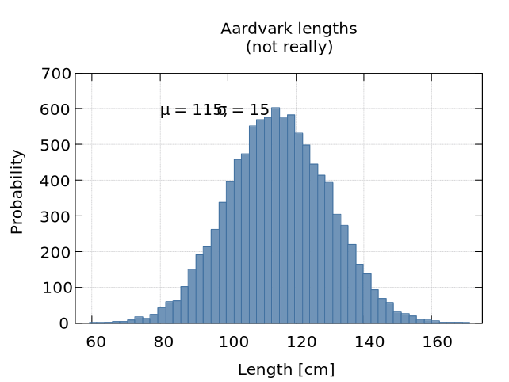

The complete code can be found at `script/labels.gp`. Note that you have to use double quotes for the escape character `\n`. The basic syntax of `set label` is: 

```
set label {<tag>} {"<label text>"} {at <position>}
```
Here, the `position` is the location of X and Y in the plot. To display the mathematical symbols, we use the special `{\Symbol}` font, where `m`, short for Greek letter `mu`, is \\(\mu\\), and `s`, short for Greek letter `sigma`, is \\(\sigma\\). Readers can refer to [Greek Letters](../apdx/greek.md) for a complete list.

> The `{\Symbol}` also supports simple mathematical notations, such as the subscript. For example `x^2` means \\(x^2\\). However, it would be troublesome to write complex mathematical equations with `{\Symbol}`, and instead you should take the leverage of *Latex*. Readers can refer to [How to write complex mathematical equations](../cook/1_30.md).

## Axis scales and ticks
Each Axes has two (or three) axis representing the x- and y-axis. These control the scale of the axis, the tick locators and the tick formatters.

### Scale
In addition to the linear scale, gnuplot supplies non-linear scales, such as a log-scale. Here we set the scale manually:

```
set multiplot layout 1,2
unset key
f(x) = 10**x
unset logscale y
plot '../data/artists_data.dat' using (f($2)) with lines
set logscale y
plot '../data/artists_data.dat' using (f($2)) with lines
```

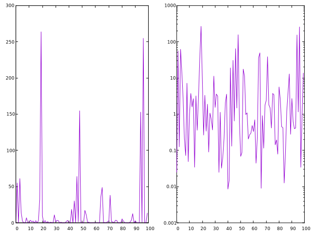

The first line is to set a multiplot mode with 1 row and 2 columns. Some readers may be not satisfied with formatting of labels in `log-scale`, and prefer the \\( 10^i \\) format. To achieve this, we can specify the format as *log*:

```
set format y "10^{%L}"
```
The complete code can be found at `script/scales.gp`.

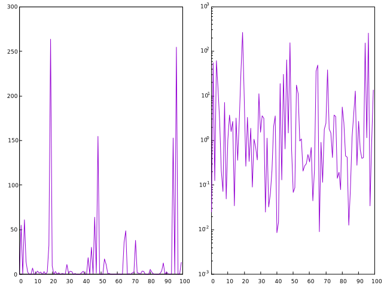

The scale sets the mapping from data values to spacing along the Axis, so it is also possible to set *log scale* for X.

### Tick locators and formatters
Each Axis has a tick locator and formatter that choose where along the Axis objects to put tick marks. A simple interface to this is `set xtics` (Of course, we can also use `set ytics` to custom the ticks of Y).

```
set multiplot layout 2,1
unset key

set title 'Automatic ticks'
plot '../data/artists_data.dat' using 2 with lines

set title 'Manual ticks'
set ytics -1.5,1.5,1.5
set xtics ("zero" 0, "30" 30, "sixty" 60, "90" 90)
plot '../data/artists_data.dat' using 2 with lines
```

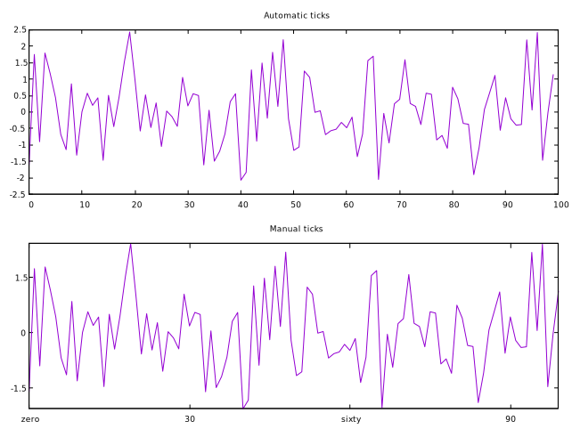

The code above shows two basic usages of `set xtics` (`set ytics`) command.

```
set xtics <start>, <incr> {,<end>}
set xtics ({"<label>"} <pos> {<level>} {,{"<label>"}...)
```

So `set ytics -1.5,1.5,1.5` means the tic starts from -1.5, and ends to 1.5, and the step is 1.5 (always positive). As for the second usage, the default level is 0, indicting the major tick, and level 1 means the minor tick. So `"zero" 0` means to display *zero* at position 0.

> Like many other Linux tools, gnuplot is shipped with a detailed documentation, and users can invoke `help <command>` to ask for help. For example, you can access gnuplot’s built-in reference documentation about how to set tics on X by typing `help set xtics`.

### Plotting dates and strings
Gnuplot can handle plotting arrays of dates and arrays of strings, as well as floating point numbers. These get special locators and formatters as appropriate. 

For dates, gnuplot offers a set of command for processing *time series* data. The classic approach uses `set _data`, `set timefmt` and `set _tics format`, which let you parse and arbitrary data/time information. This is gnuplot’s most flexible and powerful method of handling timestamps.

The dataset can be found `data/date.dat`, which is generated by `numpy`.

```
2021-11-15 00:00:00   0.047934
2021-11-15 01:00:00   0.811732
2021-11-15 02:00:00    2.66169
...
```

```
unset key
set xdata time
set timefmt "%Y-%m-%d %H:%M:%S"
set xtics format "%m-%d"
plot "../data/date.dat" u 1:3 w lines lw 1.5
```

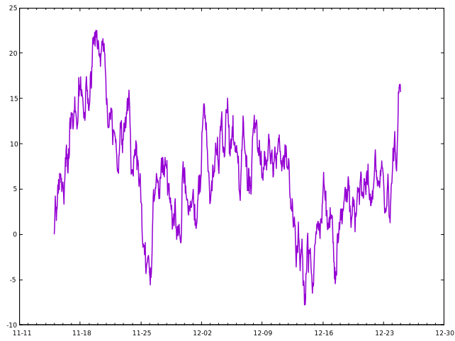

The second line `set xdata time` is to set the data on X as *time*. The third line `set timefmt <format string>` is to specify the time format, where `%Y` means a 4-digit year, `%m` means month, `%d` means a day of a month, `%H` means an hour, `%M` means the minute. You can use `help set timefmt` to have a look at the document. The fourth line is to set the format of the tics on X, `%m-%d` means the month and day are displayed.

> Note that the supported format strings for `set timefmt` and `set xtics format` are not always the same. For example, `%F` is a shorthand for `%H:%M:%S`, and it is only available for `set _tics format`. Readers can refer to [Time Format](../apdx/time_format.md) for details.

For strings, we get categorical plotting. We prepared a dataset at `data/strings.dat`:

```
turnips 0.4
rutabaga 0.42
cucumber 0.57
pumpkins 0.44
```

```
unset key
set yrange [0:0.6]
set ytics 0,0.1,0.6
set xrange [-1:4]
set style fill solid 0.5
set boxwidth 0.8
plot "../data/strings.dat" using 2:xticlabels(1) with boxes
```

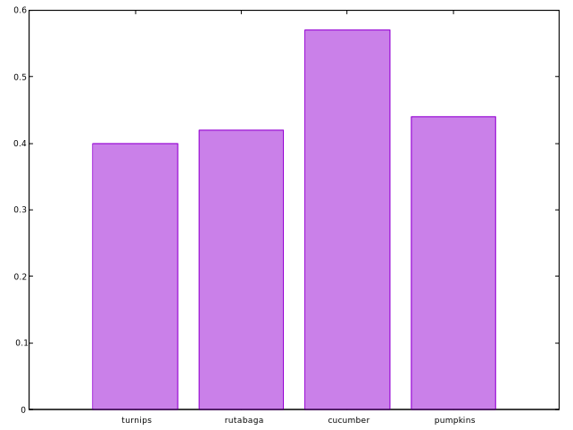

Here we are using `boxes`, and it is also possible to plot this using histograms. But histograms are mainly used to plot multi-group data.

As for a 2D *box* plotting, only one dimension is required, and we can use an extra column to be the ticks labels. So `2:xticlabels(1)` means plotting with the second (2nd) column and its first (1st) column is used as ticks labels on X. By default, each box extends to touch the adjacent boxes (in other words, width is 1), and `set boxwidth` is to set its width.

## Additional Axis objects
Plotting data of different magnitude in one chart may require an additional y-axis. As for a 2D figure in gnuplot, we are, in fact, plotting on *X1* (bottom) and *Y1* (left). The mirror of X1 is *X2*, which is located on the top, and the mirror of Y1 is *Y2*, which is located on the right side. Therefore, each axis can have a different scale and tick format in gnuplot.

