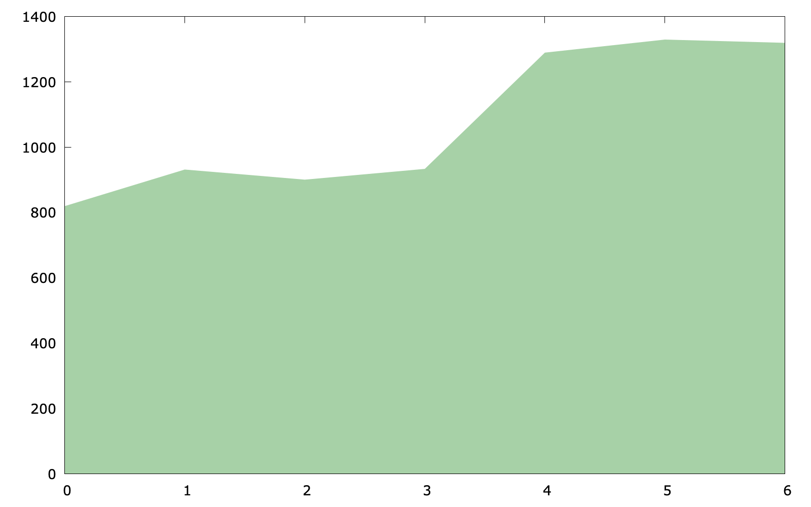
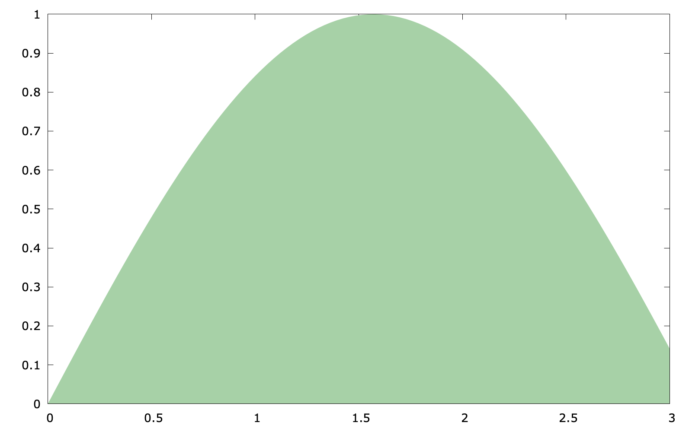
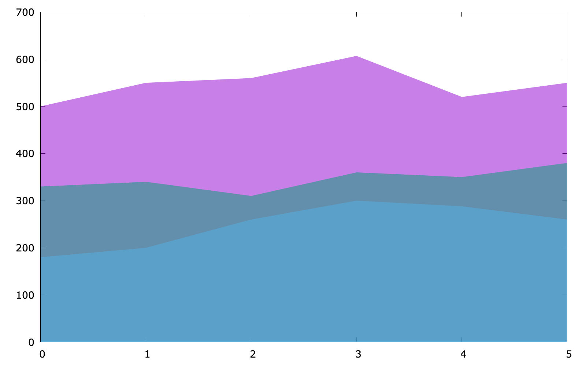

# More Examples
In this section, we show more example in gnuplot.

> The script in this section can be found `script/examples`.

## Basic area chart
```
set style fill solid 0.4 noborder
plot $data with filledcurves y=0 lc rgb "forest-green"
```

The key point of the code (`area_chart.gp`) is `with filledcurves y=0`, because we would like to set a line at `y=0` (it is also fine to use `y1=0`).



In addition, if the plot target is a function, the following code is also feasible:

```
set style fill solid 0.4 noborder
set style function filledcurves y=0
set xrange [0:3]
plot sin(x) lc rgb "forest-green"
```

The code above (`area_chart2.gp`) uses something new: `set style function` which changes the default plotting style for function plots



## Stacked area chart
As for a stacked area chart, the code has no much difference (`stacked_area.pg`):

```
set style fill transparent solid 0.5 noborder
plot $data u 1 with filledcurves y=0, \
$data u 2 with filledcurves y=0, \
$data u 3 with filledcurves y=0
```

