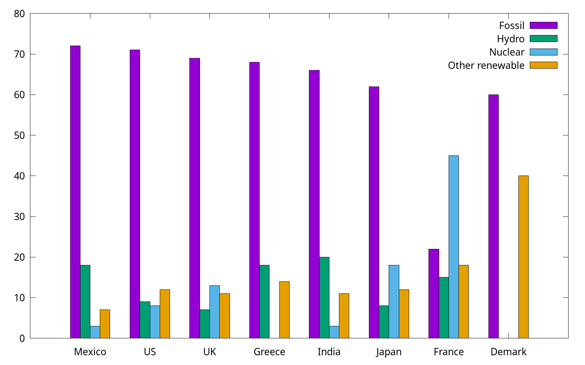
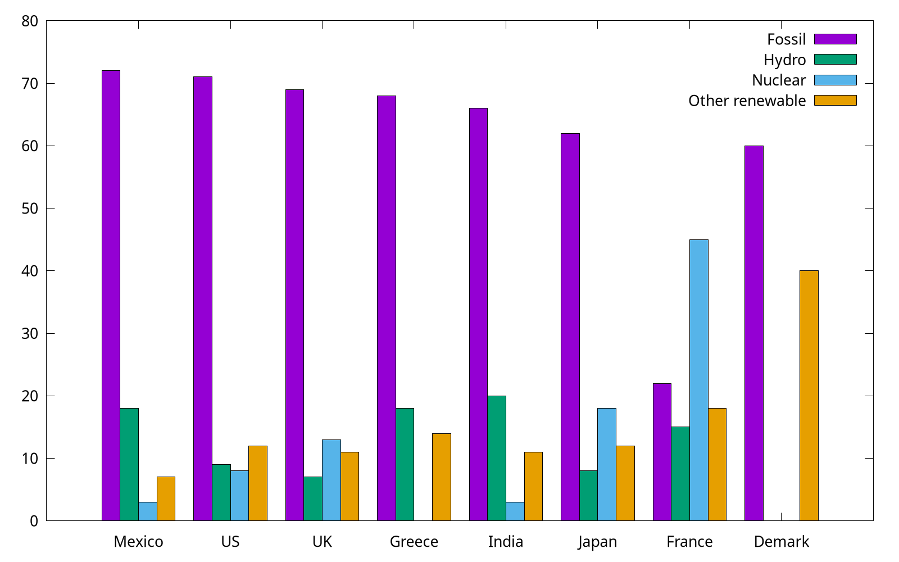

# More Examples
In this section, we show more example in gnuplot.

> The script in this section can be found `script/examples`.

## Basic area chart
```
set style fill solid 0.4 noborder
plot $data with filledcurves y=0 lc rgb "forest-green"
```

The key point of the code (`area_chart.gp`) is `with filledcurves y=0`, because we would like to set a line at `y=0` (it is also fine to use `y1=0`).


In addition, if the plot target is a function, the following code is also feasible:

```
set style fill solid 0.4 noborder
set style function filledcurves y=0
set xrange [0:3]
plot sin(x) lc rgb "forest-green"
```

The code above (`area_chart2.gp`) uses something new: `set style function` which changes the default plotting style for function plots


## Stacked area chart
As for a stacked area chart, the code has no much difference (`stacked_area.pg`):

```
set style fill transparent solid 0.5 noborder
plot $data u 1 with filledcurves y=0, \
$data u 2 with filledcurves y=0, \
$data u 3 with filledcurves y=0
```


## Revisit bar chart

We have already shown how to use `with boxes` to plot categorical items in [Plotting dates and strings](basic_usage.md#plotting-dates-and-strings), but for multi groups, a *histogram* is preferred. In the following, we use the provided `energy` file. This part is adapted from *gnuplot 5* by Lee Phillips.

```
# Country Fossil Hydro Nuclear "Other renewable"
Mexico  72  18  3   7
US  71  9   8   12
...
```
Note that the specific value shown above are *factitious*.

```
set style data histogram
set style fill solid border -1
plot "energy" u 2 title "Fossil", \
"" u 3 title "Hydro", \
"" u 4 title "Nuclear", \
"" u 5:xtic(1) title "Other renewable"
```



The complete code can be found at `energy.gp`. Gnuplot uses the "histogram" style for bar charts as well as true histograms. Because the country names (column 1) are expected to be labels on X, we use `xtic` (short for *xticlabels*) command to select the 1st column.

By the way, we can use `set style histogram cluster gap <n>` to set the gap between clusters. The default gap is 2. The following *gap* is 1, and as you can see, it has a slightly wider box.

