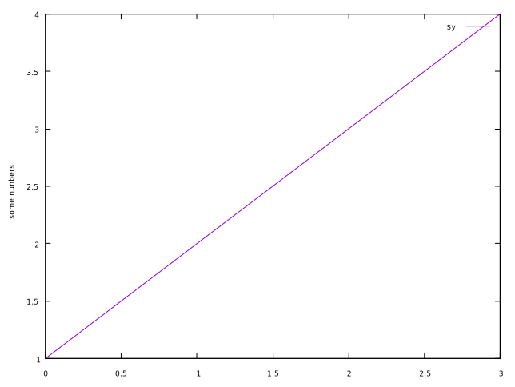
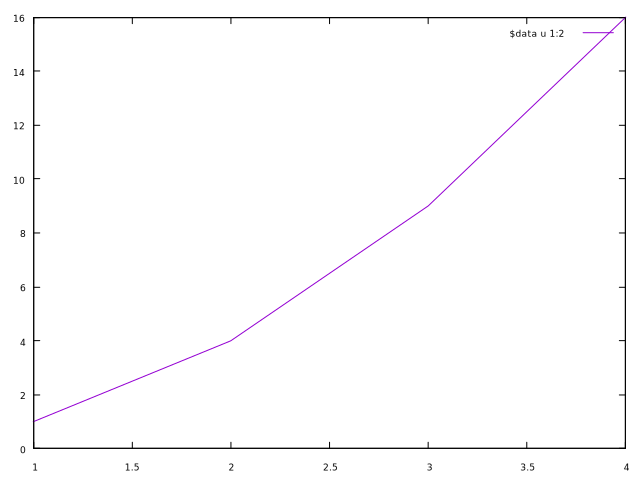
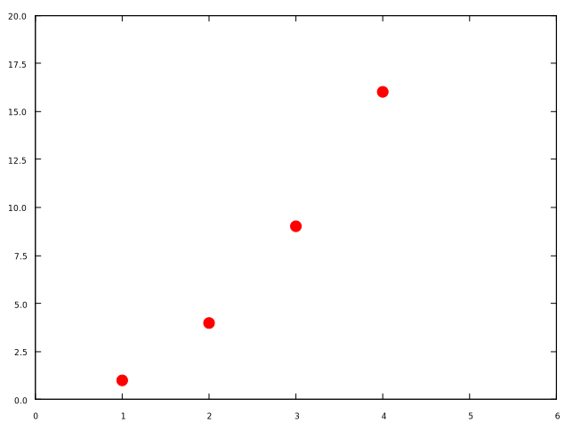
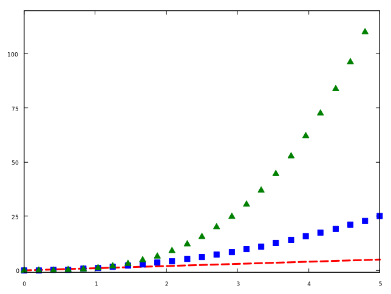
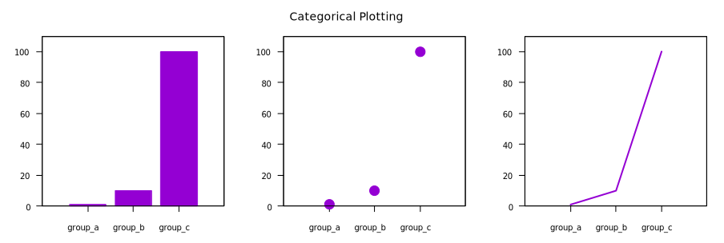
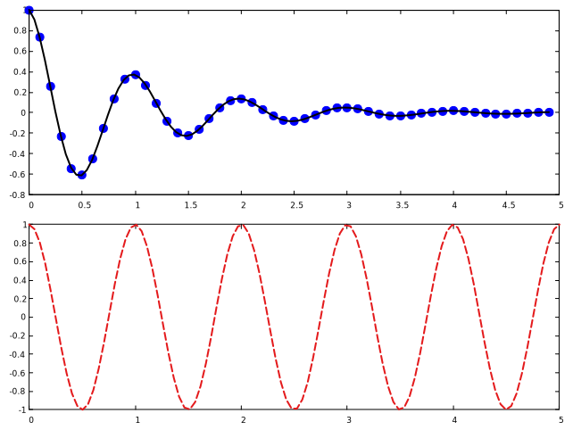
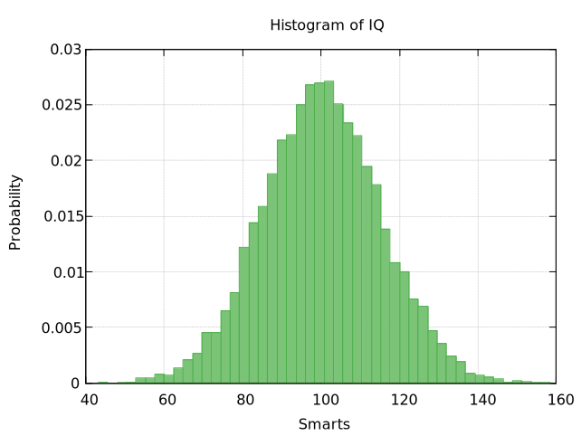

# More Tutorials
Matplotlib provides both the `pyplot` API and the object-oriented API, but gnuplot only offers *command* style, which is more like the `pyplot` API of Matplotlib. So, generally, this article has no much difference with [Basic Usage](basic_usage.md), and I only show some script to plot these figures shown in [Pyplot tutorial](https://matplotlib.org/stable/tutorials/introductory/pyplot.html). Readers can skip this section if they have already understood [Basic Usage](basic_usage.md) because most of the usages and concepts are repeated.

## Intro to plot

`plot` is the most important command in gnuplot.

```
$y << EOD
1
2
3
4
EOD
set ylabel 'some numbers'
plot $y with lines
```



You may be wondering why the x-axis ranges from 0-3 and the y-axis from 1-4. If you only provide one column for `plot`, gnuplot assumes it is a sequence of y values, automatically generates the x values (starting from 0) for you.

> 

To plot x versus y, you can write:

```
$data << EOD
1 1
2 4 
3 9
4 16
EOD
plot $data u 1:2 w l
```



Note that we are using the abbreviations:

- `u`: using
- `w`: with
- `l`: lines

### Formatting the style of your plot
It is very flexible to set the color and line type of the plot.

```
$data << EOD
1 1
2 4 
3 9
4 16
EOD
unset key
set xrange [0:6]
set yrange [0:20]
set xtics 0,1,6
set ytics 0,2.5,20
set format y "%.1f"
plot $data u 1:2 w p pt 7 lc 'red' ps 2
```



Here we specify the `lt` (*linetype*), `pt` (*pointtype*), `lc` (*linecolor*) and `ps` (*pointsize*). And we also set the ranges and tics for X and Y.

The example below illustrates plotting several lines with different format styles:

```
unset key
set xrange [0:5]
set samples 25
set yrange [-1:120]
set ytics 0,25
plot x w l dt 2 lw 3 lc 'red', \
x**2 w p pt 5 ps 1.5 lc 'blue', \
x**3 w p pt 9 ps 2 lc '#008000'
```



## Plotting with keyword strings
Gnuplot does not support such feature, but readers can refer to [Types of inputs to plotting functions](basic_usage.md#types-of-inputs-to-plotting-functions) to learn how to plot the scatter with varying sizes and colors.


As we can see, we can specify the column using `$i` for `plot`, and this feature is like *keyword strings* in Matplotlib.

## Plotting with categorical variables

```
set terminal qt size 900,300 font ',10'
set multiplot layout 1,3 title 'Categorical Plotting' font ',14'
unset key
set xrange [-1:3]
set yrange [0:110]
set xtics ('group\\\_a' 0, 'group\\\_b' 1, 'group\\\_c' 2)
set tics nomirror out
$y << EOD
1
10
100
EOD
set style fill solid
set boxwidth 0.8
plot $y with boxes

plot $y with points pt 7 ps 2

plot $y with lines lw 2

unset multiplot
```



Note that the *qt* terminal is in *enhanced text* mode, so we need to add extra `\\\` to display the underscore. Another solution is to set *noenhanced*.


## Controlling line properties
Lines have many attributes that you can set: linewidth, dash style, antialiased, etc:

```
set linetype 1 lc rgb "dark-violet" lw 2 
```

## Working with multiple figures and axes

```
set multiplot layout 2,1
unset key
set linetype 1 lc "black" lw 2
set linetype 2 lc rgb '#E41A1C' dt 2 lw 2 # red
f(x) = exp(-x) * cos(2*pi*x)
plot '../../data/t1.dat' using 1:(f($1)) with points pt 7 ps 1.5 lc 'blue', f(x) with lines ls 1

g(x) = cos(2*pi*x)
plot [0:5][] g(x) with lines ls 2
```



## Working with text

```
set terminal qt font ',16'
set title "Histogra of IQ"
set xlabel 'Smarts'
set ylabel 'Probability'
set label '{/Symbol m} = 100, {/Symbol s} = 15' at 60,600
unset key
set xrange [40:160]
set grid
set style fill solid 0.75
bin(x,s)  = s*floor(x/s)
binc(x,s) = s*(floor(x/s)+0.5)
set boxwidth 120/50.
stats 'smart.dat' u 1 noout
plot 'smart.dat' using (binc($1,120/50.)):(1./(120/50.*STATS_records)) smooth frequency with boxes fc '#4DAF4A'
```



The script (`smart.gp`) uses a trick to compute the probability, because it would display frequency for given *bins*.