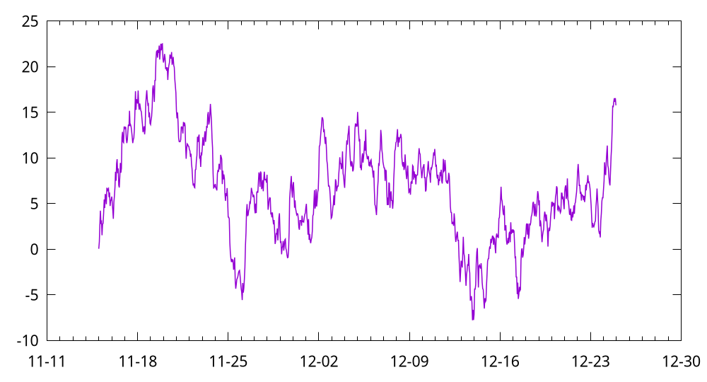
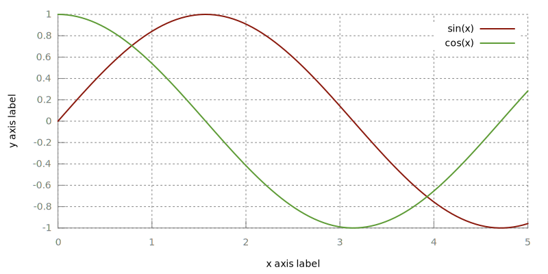
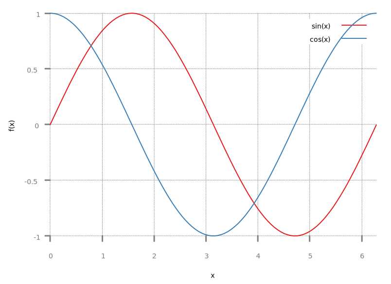
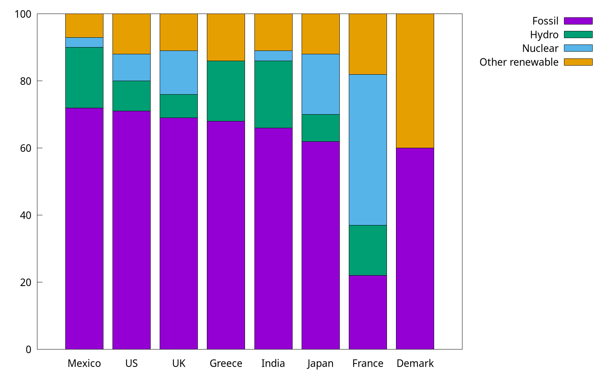
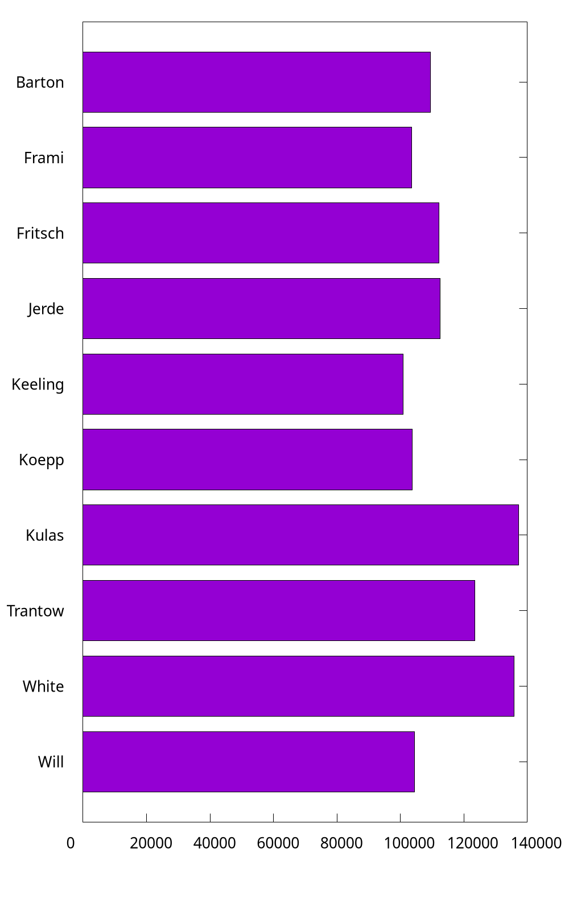

# Item 1-30
## 1. How to resize the figure
Command `set size ratio` can set the radio of height/width. However, this won't affect the size of figure itself, and it will only change the ratio the plotting area. To remove the extra space, we can use `size <width>, <height>` when `set terminal`.

> Note that the `size` has different meanings for different `terminal`. See more at [Save plot](../ch1/tutorials.md#save-plot).

For example, the following code is used to plot the time series data like [Plotting dates and strings](../ch1/basic_usage.html#plotting-dates-and-strings):

```
set terminal pngcairo transparent size 1000,540 enhanced font 'Verdana,16'
set output 'date.png'
unset key
set xdata time
set timefmt "%Y-%m-%d %H:%M:00"
set xtics format "%m-%d"
plot "date.dat" u 1:3 w lines lw 1.5
```



## 2. How to write complex mathematical expressions
We can set *Latex* as the output in gnuplot, and thus this feature makes it very convenient to write complex mathematical expressions.

```
set term epslatex standalone color
set samples 1000
set output 'example.tex'
plot sin(x) title '$\sigma \frac{3}{4}$'
```

The code can be found at `math.gp`. Here, we set the `term` (short for *terminal*) as `epslatex`, and the remaining options:

- `standalone`: The output is a standalone *.tex* file. Otherwise, we can only include the output in another *Latex* file.
- `color`: As the name implies, the output will always be colorful. Otherwise, some lines may be in monochrome mode.

The third line is to specify the output file. In fact, another *.eps* file will also be generated (you do not have to specify its name), where *.tex* manages the mathematical expression, and *.eps* accounts for the plotting itself. We can run this script by `gnuplot math.gp` in the shell:

```sh
$ gunplot math.gp
$ ls
$ example-inc.eps  example.tex  math.gp
```

After that, we can compile it to [PDF](img/math.pdf) via *Latex*.

I also wrote a helper script (`tex2eps.sh`) to generate a standalone *.eps* figure from *.tex*. Suppose there are `example-inc.eps` and `example.tex` in the current folder.

```sh
$ ./tex2eps.sh example.tex
```

Then it would generate a standalone *.eps* file containing both plot itself and mathematical expressions.

## 3. How to reuse gnuplot's styles
This article is adapted from [How to make gnuplot charts look more visually appealing?](https://stackoverflow.com/questions/41602351). As we have already seen, the default style of gnuplot is not appealing enough, and we often need custom configs, such as `lw` (*linewidth*). 

Some people may would like to a standalone script. They may collect some fancy *styles*, and copy these styles into their current working script.

```
# define axis
# remove border on top and right and set color to gray
set style line 11 lc rgb '#808080' lt 1
set border 3 back ls 11
set tics nomirror
# define grid
set style line 12 lc rgb '#808080' lt 0 lw 1
set grid back ls 12

# color definitions
set style line 1 lc rgb '#8b1a0e' pt 1 ps 1 lt 1 lw 2 # --- red
set style line 2 lc rgb '#5e9c36' pt 6 ps 1 lt 1 lw 2 # --- green
```

The complete script can be found at `fancy.gp`.



You can also store these styles in an external file. Here we prepare another `style` file which configs the *line*, *border*, *ticks*, *border* and *grid*, and then we can load it in our script:

```
load "style"
set terminal qt font "Alegreya, 14" size 800, 580

set xlabel "x"
set ylabel "f(x)"
set grid
set key right top
set xrange[0:6.28]
set yrange[-1:1]

plot sin(x) w l ls 1, cos(x) w l ls 2
```



> The same technology is also used in [Loading palette](../apdx/palette.md#loading-palettepalette).

By the way, one can also rename `style` to `.gnuplot` and put it in her home directory (it works on Linux and macOS). Then gnuplot would automatically load this file.

## 4. How to plot stacked bar charts
We reuse the example in [Revisit bar chart](../ch1/examples.md#revisit-bar-chart), and try to plot it as a stacked bar.

```
set style data histogram
set style histogram rowstacked
set boxwidth 0.8 relative
```



In the code (`stacked.gp`), we use `set style histogram rowstacked` to set the histogram *rowstacked*, and the default style corresponds to `set style histogram clustered gap 2`. 

Note that to make some space between boxes, we use the syntax `set boxwidth {<width>} {absolute|relative}`. By default, adjacent boxes are extended in width until they touch each other. `Relative` widths are interpreted as being a fraction of this default width, and this option is widely used.


## 5. How to plot horizontal bar charts
As we mentioned in [Horizontal bar](../ch1/tutorials.md#horizontal-bar), we can use `boxxyerror` to plot a horizontal bar. Here we use another trick: *by rotating* (`hbar.gp`).

```
set bmargin 4
set tmargin 2
set style fill solid border -1
set boxwidth 0.8
set y2range [0:*]
set y2tics
set xtics offset 0,-0.5 right
set xtics rotate by 90
set y2tics rotate by 90
set y2tics offset 0,-1
```

And we also have to rotate the output by hand.



It is a bit complicated. So I still recommend the method introduced in [Horizontal bar](../ch1/tutorials.md#horizontal-bar).


## 6. How to customize borders?

Sometimes, we may like to keep the X1 (bottom) and Y1 (left) only. We add the code in the following into `stacked.gp`:

```
set border 3
```


As shown in [How to reuse gnuplot styles](#3-how-to-reuse-gnuplots-styles), it is also possible to set borders' other properties, such as *linetype*, *linecolor*, and *linewidth*. So, what does *3* mean here? The borders are encoded in a 12-bit integer: the four low bits control the border for `plot`:

- 1: bottom
- 2: left
- 4: top
- 8: right

Therefore, *3* is the sum of 1 and 2, indicting *bottom* and *left*, respectively.