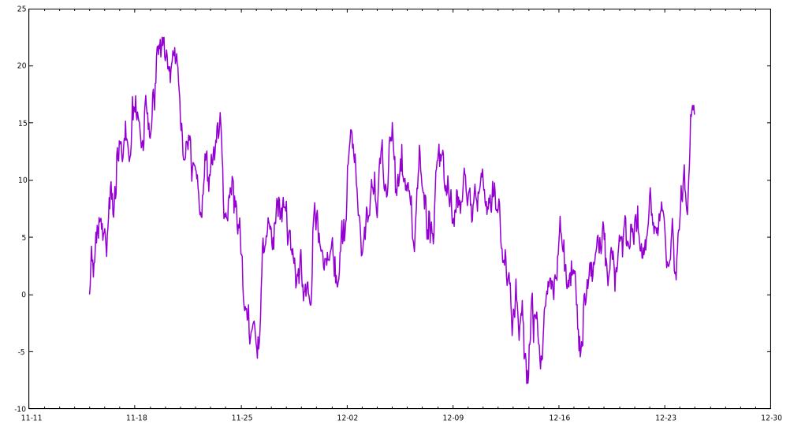

# Item 1-30
## 1. How to resize the figure
Command `set size ratio` can set the radio of height/width. However, this won't affect the size of figure itself, and it will only change the ratio the plotting area. To remove the extra space, we can use `size <width>, <height>` when `set terminal`.

For example, the following code is used to plot the time series data like [Plotting dates and strings](../ch1/basic_usage.html#plotting-dates-and-strings):

```
set terminal qt size 1000,540
set size ratio 2.7/5
unset key
set xdata time
set timefmt "%Y-%m-%d %H:%M:00"
set xtics format "%m-%d"
plot "date.dat" u 1:3 w lines lw 1.5
```



## 2. How to write complex mathematical expressions
We can set *Latex* as the output in gnuplot, and thus this feature makes it very convenient to write complex mathematical expressions.

```
set term epslatex standalone color
set samples 1000
set output 'example.tex'
plot sin(x) title '$\sigma \frac{3}{4}$'
```

The code can be found at `math.gp`. Here, we set the `term` (short for *terminal*) as `epslatex`, and the remaining options:

- `standalone`: The output is a standalone *.tex* file. Otherwise, we can only include the output in another *Latex* file.
- `color`: As the name implies, the output will always be colorful. Otherwise, some lines may be in monochrome mode.

The third line is to specify the output file. In fact, another *.eps* file will also be generated (you do not have to specify its name), where *.tex* manages the mathematical expression, and *.eps* accounts for the plotting itself. We can run this script by `gnuplot math.gp` in the shell:

```sh
$ gunplot math.gp
$ ls
$ example-inc.eps  example.tex  math.gp
```

After that, we can compile it to PDF via *Latex*.

<embed src="img/math.pdf">

I also wrote a helper script (`tex2eps.sh`) to generate a standalone *.eps* figure from *.tex*. Suppose there are `example-inc.eps` and `example.tex` in the current folder.

```sh
$ ./tex2eps.sh example.tex
```

Then it would generate a standalone *.eps* file containing both plot itself and mathematical expressions.