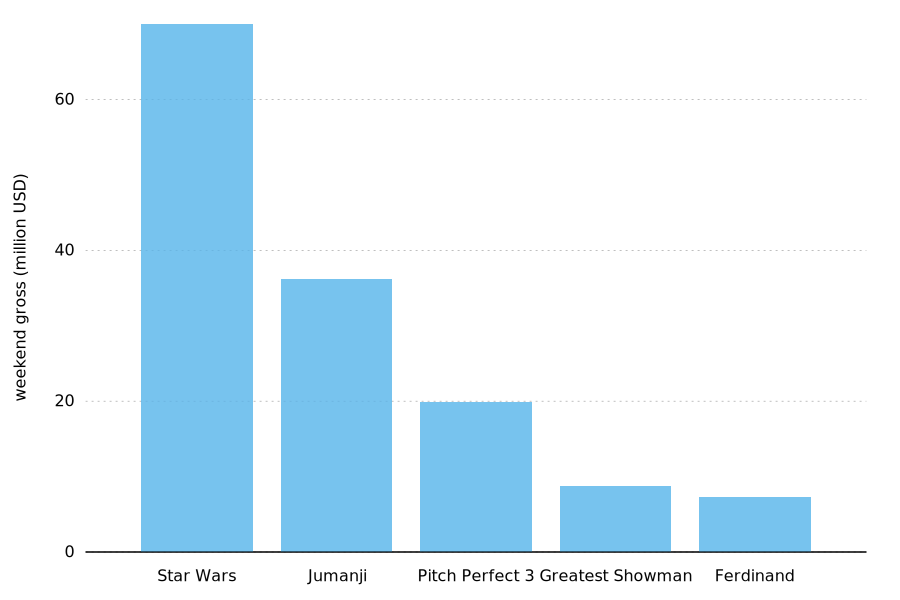
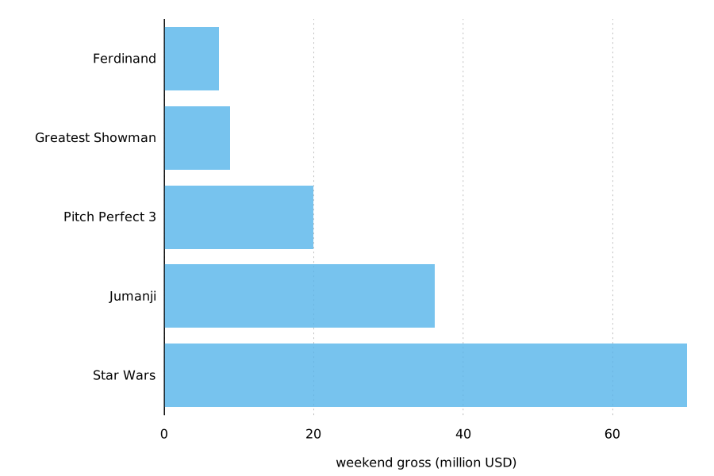

# Visualizing amounts
In many scenarios, we are interested in the magnitude of some set of numbers. The standard visualization in this scenario is the bar plot, which comes in several variations, including simple bars as well as grouped and stacked bars. Alternatives to the bar plot are the dot plot and the heatmap.

## Bar plots

Whenever the labels are too long to place horizontally they also don’t look good rotated (`movie.gp`). The better solution for long labels is usually to swap the x and the y axis, so that the bars run horizontally (`movie2.gp`).

> Pay attention to the bar order. If the bars represent unordered categories, order them by ascending or descending data values.

