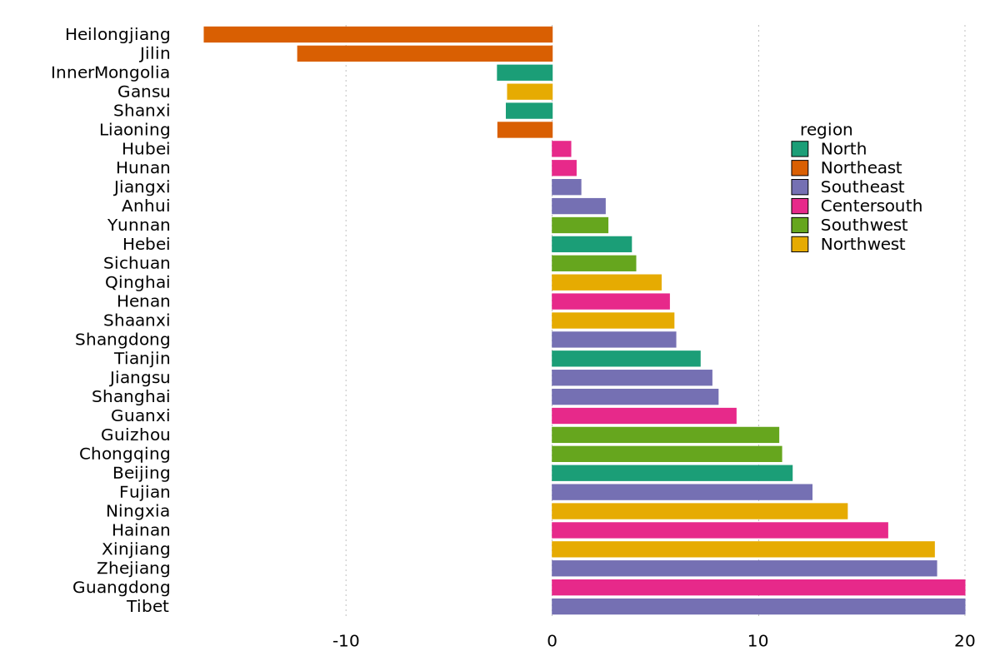
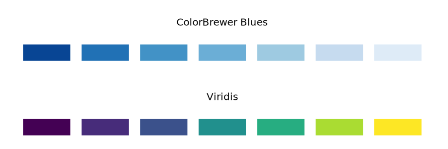

# Color scales

## Color as a tool to distinguish
We frequently use color as a means to distinguish discrete items or groups that do not have an intrinsic order, such as different countries on a map or different manufacturers of a certain product. In this case, we use a **qualitative** color scale. Many appropriate qualitative color scales are readily available. The following figure shows three representative examples (`color.gp`). 


- [Okabe Ito](https://jfly.uni-koeln.de/color/) is a color-blind safe qualitative [colorscale](https://mikemol.github.io/technique/colorblind/2018/02/11/color-safe-palette.html).
- [ColorBrewer Dark2](https://colorbrewer2.org/#type=qualitative&scheme=Dark2&n=7) is s provided by the ColorBrewer project.

Unfortunately, gnuplot does not provide built-in method to specify a *color scale*, and you have to do some manual work. Readers can refer to [Color maps from colorbrewer](http://www.gnuplotting.org/color-maps-from-colorbrewer/) and [Item 8](../cook/1_30.md#8-how-to-specify-color-schemes) for more instructions. The following figure is an example of [Paired.plt](https://github.com/aschn/gnuplot-colorbrewer/blob/master/qualitative/Paired.plt) provided by *ColorBrewer* (`pair.gp`):

```
f(x,i) = cos(x - 1.0 + i/10.0)

load 'Paired.plt'
plot for [ii=1:8] f(x,ii) ls ii lw 2
```


Cool! A nice color scheme! 

As an example of how we use qualitative color scales, consider the following figure. It shows the percent population growth from 2010 to 2020 in China (`population.gp`).



## Color to represent data values

Color can also be used to represent data values, such as income, temperature, or speed. In this case, we use a **sequential** color scale. Such a scale contains a sequence of colors that clearly indicate (i) which values are larger or smaller than which other ones and (ii) how distant two specific values are from each other. The second point implies that the color scale needs to be perceived to vary uniformly across its entire range.

Sequential scales can be based on a single hue (e.g., from dark blue to light blue) or on multiple hues (e.g., from dark red to light yellow).




- ColorBrewer Blues (from dark to light blue): See more at [Blues.plt](https://github.com/aschn/gnuplot-colorbrewer/blob/master/sequential/Blues.plt).
- [Viridis](https://cran.r-project.org/web/packages/viridis/vignettes/intro-to-viridis.html) (from dark blue via green to light yellow): The viridis palette was initially developed for the python package matplotlib, and was implemented in R later. See more at [viridis.pal](https://github.com/Gnuplotting/gnuplot-palettes/blob/master/viridis.pal).

Representing data values as colors is particularly useful when we want to show how the data values vary across geographic regions. In this case, we can draw a map of the geographic regions and color them by the data values. Such maps are called *choropleths*. Unlike R, gnuplot does not support built-in geo-maps, and readers can refer to the following links:

- [U.S. states and election results](http://www.gnuplotting.org/us-states-and-election-results/)
- [Plotting the world](http://www.gnuplotting.org/plotting-the-world/)
- [Plotting the world revisited](http://www.gnuplotting.org/plotting-the-world-revisited/)
- [Mercator projection](http://www.gnuplotting.org/mercator-projection/)