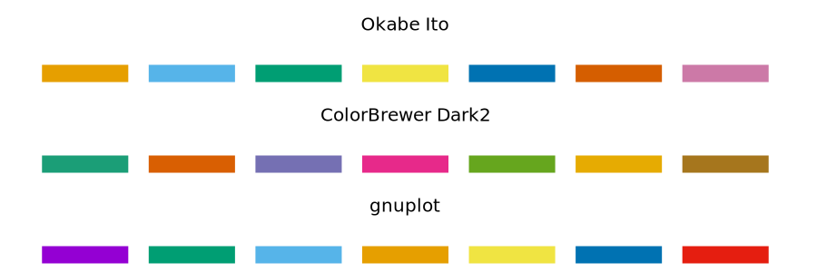
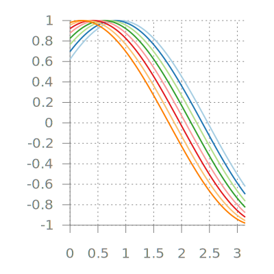

# Color scales

## Color as a tool to distinguish
We frequently use color as a means to distinguish discrete items or groups that do not have an intrinsic order, such as different countries on a map or different manufacturers of a certain product. In this case, we use a **qualitative** color scale. Many appropriate qualitative color scales are readily available. The following figure shows three representative examples (`color.gp`). 



- [Okabe Ito](https://jfly.uni-koeln.de/color/) is a color-blind safe qualitative [colorscale](https://mikemol.github.io/technique/colorblind/2018/02/11/color-safe-palette.html).
- [ColorBrewer Dark2](https://colorbrewer2.org/#type=qualitative&scheme=Dark2&n=7) is s provided by the ColorBrewer project.

Unfortunately, gnuplot does not provide built-in method to specify a *color scale*, and you have to do some manual work. Readers can refer to [Color maps from colorbrewer](http://www.gnuplotting.org/color-maps-from-colorbrewer/) and [Item 8](../cook/1_30.md#8-how-to-specify-color-schemes) for more instructions. The following figure is an example of [Paired.plt](https://github.com/aschn/gnuplot-colorbrewer/blob/master/qualitative/Paired.plt) provided by *ColorBrewer* (`pair.gp`):

```
f(x,i) = cos(x - 1.0 + i/10.0)

load 'Paired.plt'
plot for [ii=1:8] f(x,ii) ls ii lw 2
```


Cool! A nice color scheme! 