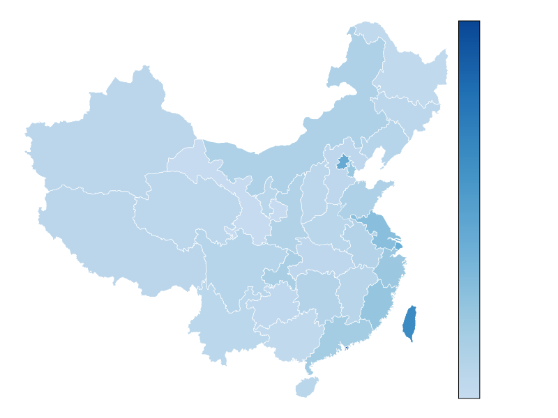
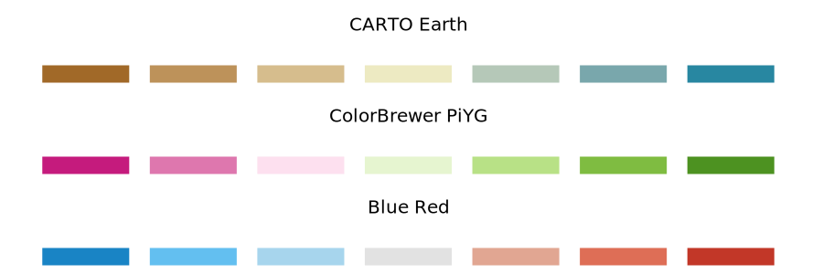
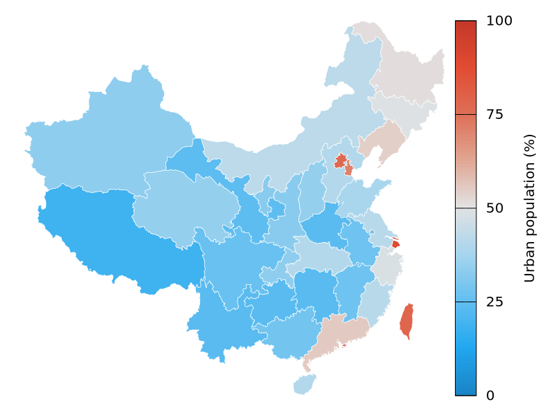

# Color scales

## Color as a tool to distinguish
We frequently use color as a means to distinguish discrete items or groups that do not have an intrinsic order, such as different countries on a map or different manufacturers of a certain product. In this case, we use a **qualitative** color scale. Many appropriate qualitative color scales are readily available. The following figure shows three representative examples (`color.gp`). 


- [Okabe Ito](https://jfly.uni-koeln.de/color/) is a color-blind safe qualitative [colorscale](https://mikemol.github.io/technique/colorblind/2018/02/11/color-safe-palette.html).
- [ColorBrewer Dark2](https://colorbrewer2.org/#type=qualitative&scheme=Dark2&n=7) is s provided by the ColorBrewer project.

Unfortunately, gnuplot does not provide built-in method to specify a *color scale*, and you have to do some manual work. Readers can refer to [Color maps from colorbrewer](http://www.gnuplotting.org/color-maps-from-colorbrewer/) and [Item 8](../cook/1_30.md#8-how-to-specify-color-schemes) for more instructions. The following figure is an example of [Paired.plt](https://github.com/aschn/gnuplot-colorbrewer/blob/master/qualitative/Paired.plt) provided by *ColorBrewer* (`pair.gp`):

```
f(x,i) = cos(x - 1.0 + i/10.0)

load 'Paired.plt'
plot for [ii=1:8] f(x,ii) ls ii lw 2
```


Cool! A nice color scheme! 

As an example of how we use qualitative color scales, consider the following figure. It shows the percent population growth from 2010 to 2020 in China (`population.gp`).


## Color to represent data values

Color can also be used to represent data values, such as income, temperature, or speed. In this case, we use a **sequential** color scale. Such a scale contains a sequence of colors that clearly indicate (i) which values are larger or smaller than which other ones and (ii) how distant two specific values are from each other. The second point implies that the color scale needs to be perceived to vary uniformly across its entire range.

Sequential scales can be based on a single hue (e.g., from dark blue to light blue) or on multiple hues (e.g., from dark red to light yellow).


- ColorBrewer Blues (from dark to light blue): See more at [Blues.plt](https://github.com/aschn/gnuplot-colorbrewer/blob/master/sequential/Blues.plt).
- [Viridis](https://cran.r-project.org/web/packages/viridis/vignettes/intro-to-viridis.html) (from dark blue via green to light yellow): The viridis palette was initially developed for the python package matplotlib, and was implemented in R later. See more at [viridis.pal](https://github.com/Gnuplotting/gnuplot-palettes/blob/master/viridis.pal).

Representing data values as colors is particularly useful when we want to show how the data values vary across geographic regions. In this case, we can draw a map of the geographic regions and color them by the data values. Such maps are called *choropleths*. Unlike R, gnuplot does not support built-in geo-maps, and readers can refer to useful links:

- [gnuplot-geomap](https://github.com/ChenZhongPu/gnuplot-geomap)
- [U.S. states and election results](http://www.gnuplotting.org/us-states-and-election-results/)
- [Plotting the world](http://www.gnuplotting.org/plotting-the-world/)
- [Plotting the world revisited](http://www.gnuplotting.org/plotting-the-world-revisited/)
- [Mercator projection](http://www.gnuplotting.org/mercator-projection/)

The following figure shows an example where I have mapped average GDP onto a map of China (`salary.gp`).




In some cases, we need to visualize the deviation of data values in one of two directions relative to a neutral midpoint. One straightforward example is a dataset containing both positive and negative numbers. We may want to show those with different colors, so that it is immediately obvious whether a value is positive or negative as well as how far in either direction it deviates from zero. The appropriate color scale in this situation is a **diverging** color scale. Diverging scales need to be *balanced*, so that the progression from light colors in the center to dark colors on the outside is approximately the same in either direction (`diverging_color.gp`).



- [CARTO Earth](https://carto.com/carto-colors/): brown to greenish blue.
- [ColorBrewer PiYG](https://github.com/aschn/gnuplot-colorbrewer/blob/master/diverging/PiYG.plt): pink to yellow-green.
- Blue-Red: blue to red. See more at [HCL-Based Color Palettes](https://colorspace.r-forge.r-project.org/articles/hcl_palettes.html) and [12 Color Palettes for Telling Better Stories with Your Data](https://www.heavy.ai/blog/12-color-palettes-for-telling-better-stories-with-your-data).

As an example application of a diverging color scale, consider the following, which shows the proportion of Urban population of China in 2000 (note that it is always greater than 50% in 2020). Even though percentage is always a positive number, a diverging scale is justified here, because 50% is a meaningful midpoint value. (`urban.gp`)



## Color as a tool to highlight

Color can also be an effective tool to highlight specific elements in the data. An easy way to achieve this emphasis is to color these figure elements in a color or set of colors that vividly stand out against the rest of the figure. This effect can be achieved with **accent** color scales.

Example accent color scales, each with four base colors and three accent colors:


When working with accent colors, it is critical that the baseline colors do not compete for attention. It is easy to make the mistake of using baseline colors that are too colorful, so that they end up competing for the reader’s attention against the accent colors. There is an easy remedy, however. Just remove all color from all elements in the figure except the highlighted data categories or points.

The following figure shows *weight* and *BMI* of all American meal athletes in Beijing [Olympics](https://www.kaggle.com/datasets/heesoo37/120-years-of-olympic-history-athletes-and-results), and we can find that boxing athletes are the shortest and leanest (`sport.gp`).

