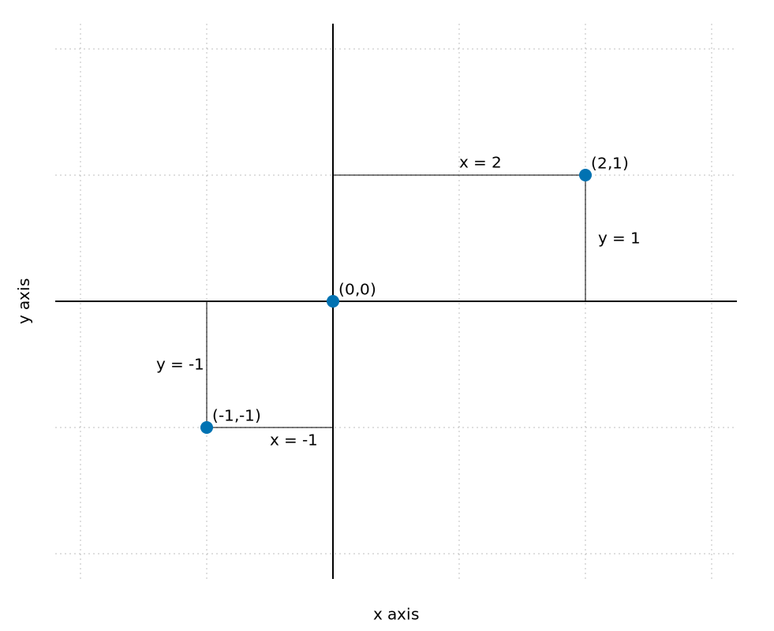
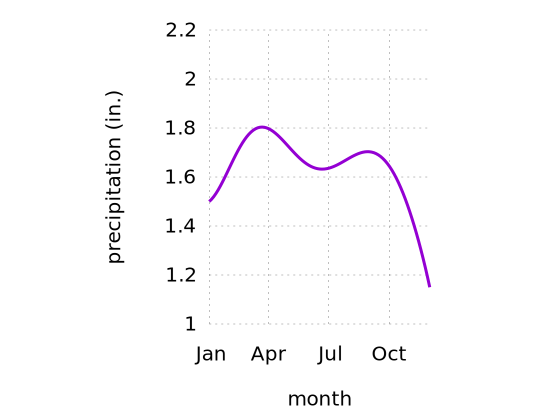
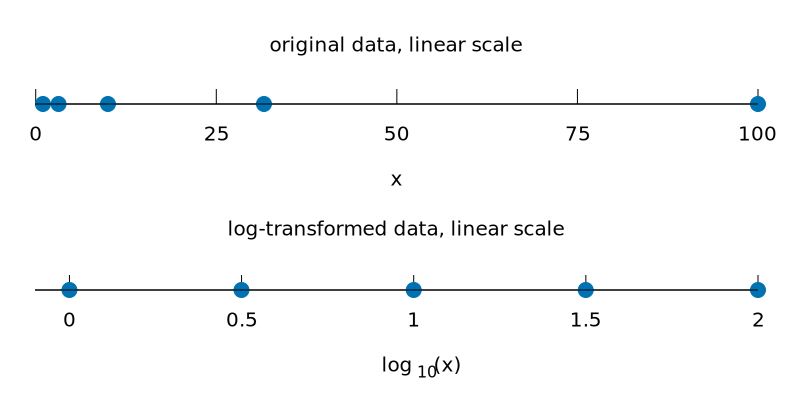
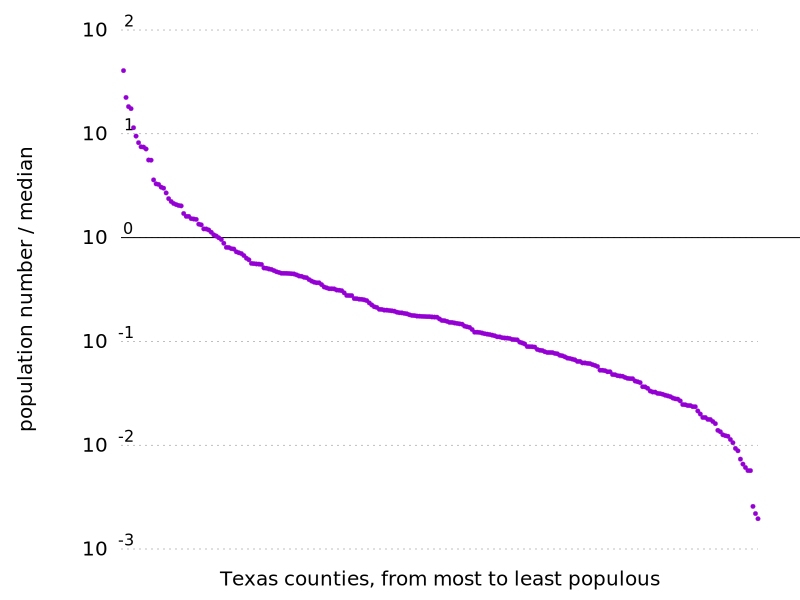

# Coordinate systems and axes
For regular 2d visualizations, two numbers are required to uniquely specify a point, and therefore we need two position scales. These two scales are usually but not necessarily the x and y axis of the plot. 

## Cartesian coordinates

The following is a standard cartesian coordinate system (`coor.gp`):

Data values usually aren’t just numbers, however. They come with units. A Cartesian coordinate system can have two axes representing two different units. This situation arises quite commonly whenever we’re mapping two different types of variables to x and y. In gnuplot, this is done by `set size ratio` and `size` option of the terminal (`coor1.gp`).

## Nonlinear axes
The most commonly used nonlinear scale is the logarithmic scale or log scale for short. The following figure shows the numbers 1, 3.16, 10, 31.6, and 100 placed on linear and log scales (`log.gp`).

As an example, I have taken the number of inhabitants in each county in Texas and have divided it by the median number of inhabitants across all Texas counties (`tx.gp`).

