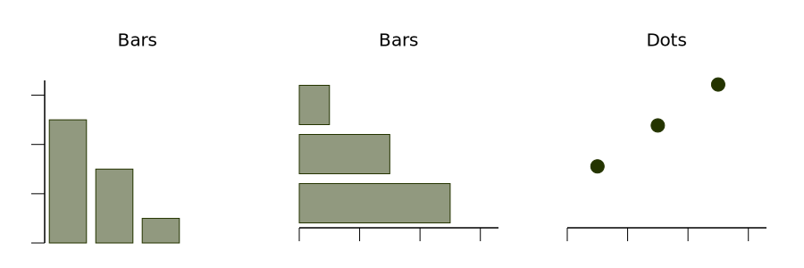
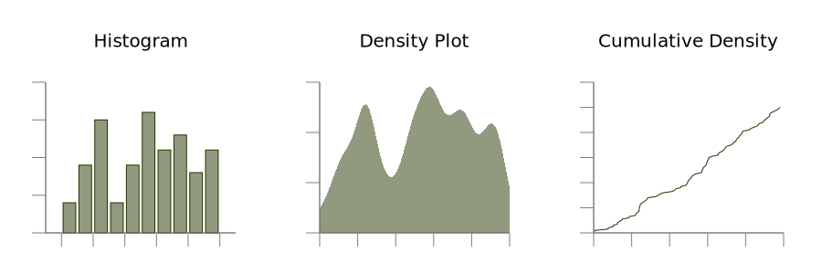
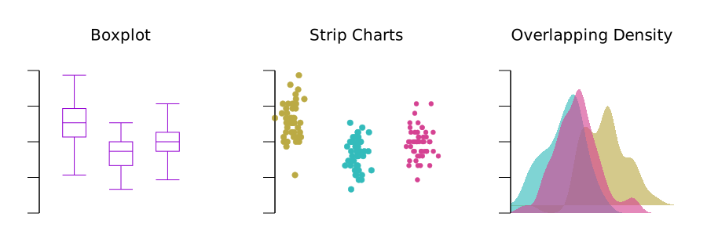
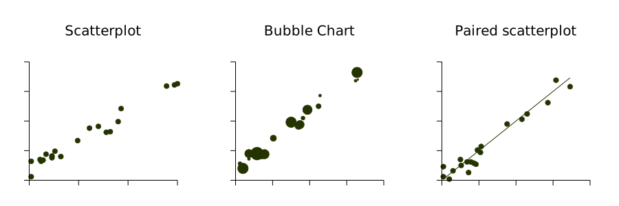
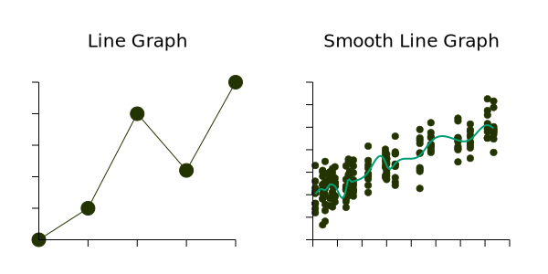

# Directory of visualizations

This section provides a quick visual overview of the various plots and charts that are commonly used to visualize data.

## Amount

The most common approach to visualizing amounts (i.e., numerical values shown for some set of categories) is using bars, or placing dots at the location where the corresponding bar would end (`amount.gp`).

If there are two or more sets of categories for which we want to show amounts, we can group or stack the bars (`amount2.gp`).

## Distributions

Histograms and density plots provide the most intuitive visualizations of a distribution, but both require arbitrary parameter choices and can be misleading. Cumulative densities always represents the data faithfully but can be more difficult to interpret (`distribution.gp`).

Boxplots, strip charts, and overlapping density plots are useful when we want to visualize many distributions at once and/or if we are primarily interested in overall shifts among the distributions (`distribution2.gp`).

## Proportions

Proportions can be visualized as pie charts, side-by-side bars, or stacked bars. Note that gnuplot does not have built-in support for pie charts.

## x–y relationships

Scatterplots represent the archetypical visualization when we want to show one quantitative variable relative to another. If we have three quantitative variables, we can map one onto the dot size, creating a variant of the scatterplot called bubble chart (`xy.gp`).

When the x axis represents time or a strictly increasing quantity such as a treatment dose, we commonly draw line graphs. We can use smooth lines to represent trends in a larger dataset (`xy2.gp`).