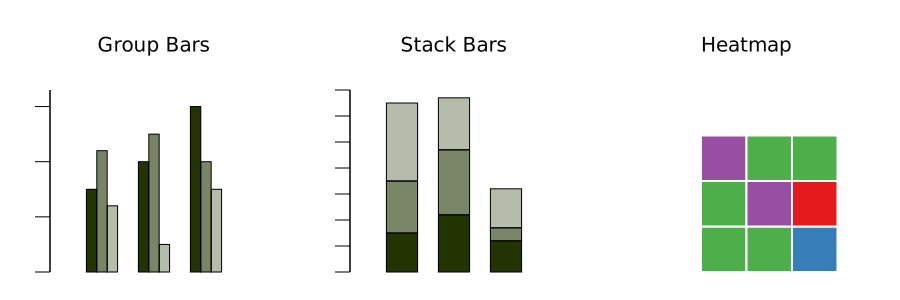

# Directory of visualizations

This section provides a quick visual overview of the various plots and charts that are commonly used to visualize data.

## Amount

The most common approach to visualizing amounts (i.e., numerical values shown for some set of categories) is using bars, or placing dots at the location where the corresponding bar would end (`amount.gp`).

If there are two or more sets of categories for which we want to show amounts, we can group or stack the bars (`amount2.gp`).

## Distributions
