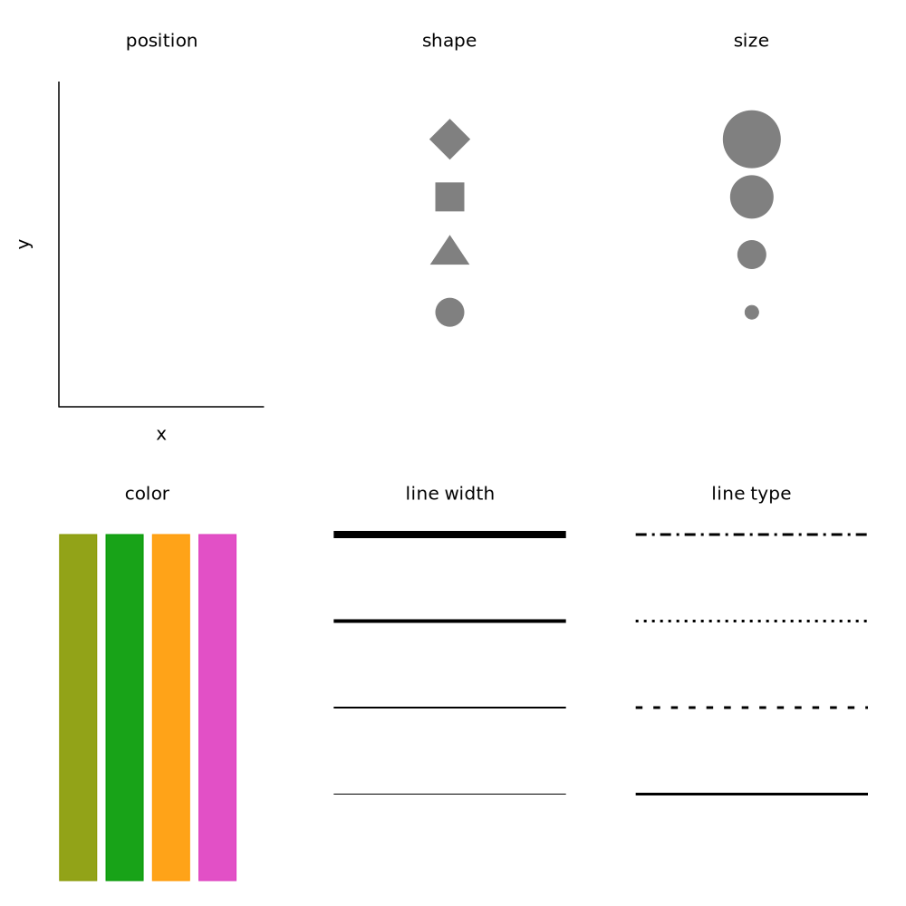
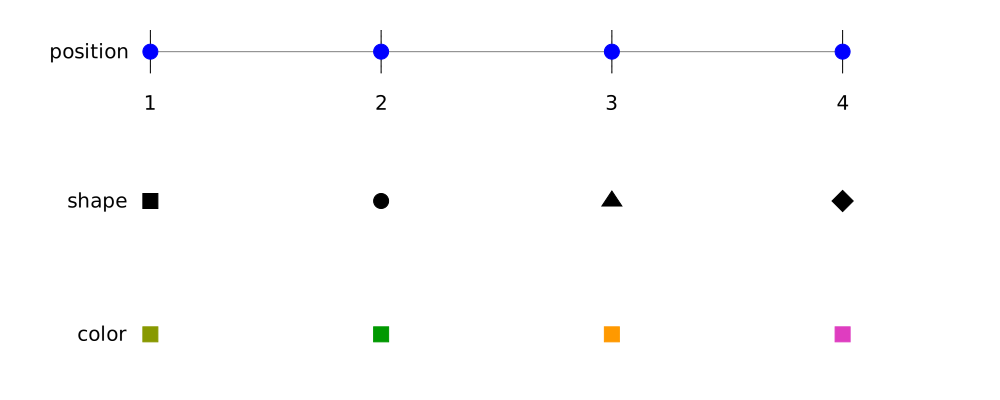
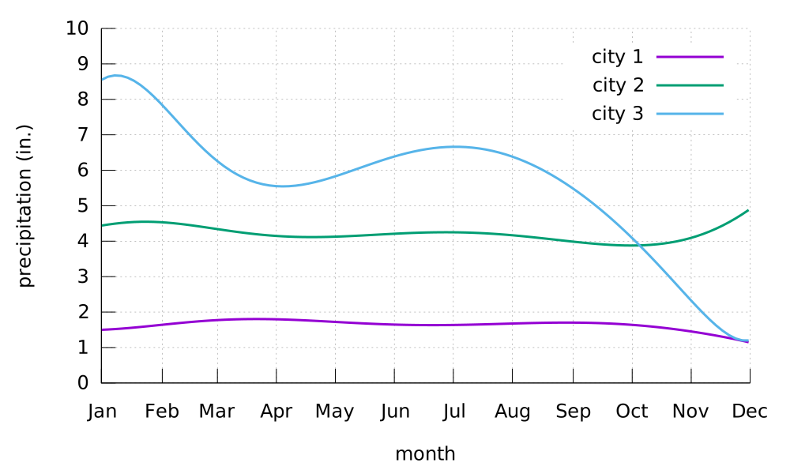
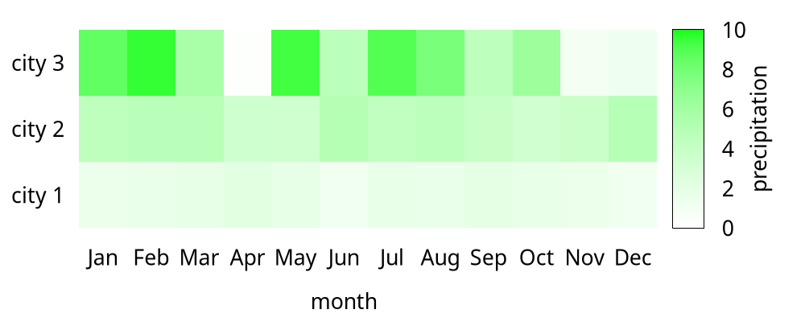

# Visualizing data: Mapping data onto aesthetics

## Aesthetics and types of data
Readers can refer to the following figure to understand the basic graphical elements in gnuplot: *position, shape, size, color, line width, line type* (`aesthetics.gp`). And readers can refer to [test.svg](../ch1/img/test.svg) for more information.



> In gnuplot, the line type is called `dt` (short for *dash type*).

If we would like to plot a figure whose X and Y are crossed at (0, 0), we can use the code (`zeroaxis.gp`):

```
unset key
unset border
unset xtics
unset ytics
set zeroaxis lt -1 lw 2
set arrow 1 from 1,0 to 2,0 nofilled size 0.1,45,60 lw 2
set arrow 2 from 0,1 to 0,2 nofilled size 0.1,45,60 lw 2
set label 1 "x" at 1.9,-0.2 font ',40'
set label 2 "y" at -0.2,2 font ',40'
plot [-2:2][-2:2] 5
```


Here we use `set zeroaxis` to achieve this.

## Scales map data values onto aesthetics
A *scale* defines a unique mapping between data and aesthetics. Importantly, a scale must be one-to-one, such that for each specific data value there is exactly one aesthetics value and vice versa (`scales.gp`).



Let’s put things into practice. We prepared the monthly precipitation data from NOAA, and use `smooth sbezier` option to make it smooth. Here we map precipitation onto the y axis, month onto the x axis, location onto color, and visualize these aesthetics with solid lines.



```
set datafile separator ","
set xdata time
set timefmt "%m"
set xtics format "%b"
unset mxtics
plot 'city.csv' u 2:3 smooth sbezier lw 3, \
'city2.csv' u 2:3 smooth sbezier lw 3, \
'city3.csv' u 2:3 smooth sbezier lw 3, 
```

The complete code can be found at `precip.gp`. 

Because now the key variable of interest (precipitation) is shown as color, we need to show sufficiently large colored areas for the color to convey useful information. Therefore, for this visualization I have chosen squares instead of lines, one for each month and location, and I have colored them by the precipitation for each month:

